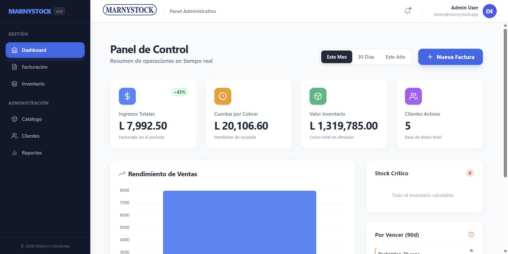
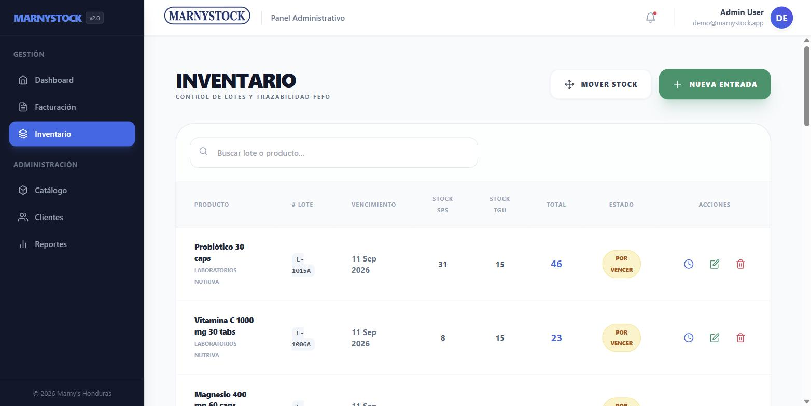
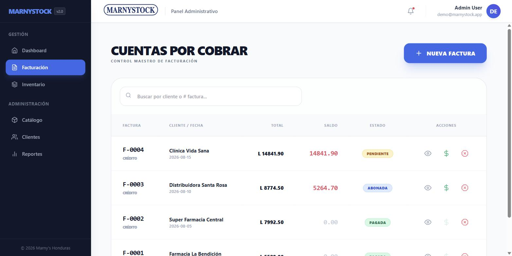

# Marnystock — Inventory & billing for perishable stock

Small distributors that sell products with an expiry date have a problem spreadsheets cannot
solve: **which physical batch leaves the warehouse when you sell one unit?** Get it wrong and
product expires on the shelf while newer stock ships first, invoices stop matching real
stock, and nobody can explain where a unit went.

Marnystock is the system I built for a distributor in Honduras that operates two branches
(San Pedro Sula and Tegucigalpa). Every sale discounts stock **FEFO** (first-expired,
first-out) across batches, and every movement — purchase, sale, transfer, bonus, return —
is written to an append-only ledger, so any batch can be traced end to end.

> Built as my engineering thesis project (CEUTEC/UNITEC, 2026) and deployed for real daily use.
> The UI is in Spanish, the language of its users.

**Live demo:** _(coming — see [Demo setup](#demo-setup))_
**Stack:** React 19 · Vite · Tailwind CSS · Firebase (Auth + Firestore + Storage) · Chart.js


_Dashboard: revenue for the period, receivables, inventory value and expiry alerts._


_Inventory by batch: expiry date, stock per branch and the status that drives FEFO._


_Receivables: each credit invoice keeps its balance until payments clear it._

---

## Run it in two minutes

```bash
git clone https://github.com/Eliasuarez2004/marnystock.git
cd marnystock
cp .env.example .env      # fill in a Firebase project (free tier is enough)
npm install
npm run dev               # http://localhost:5173
```

To get data to look at, seed a demo dataset (products, batches with staggered expiry dates,
clients, invoices with partial payments):

```bash
npm run seed:demo         # see scripts/seed-demo.mjs
```

## What it does

| Area | What it solves |
|---|---|
| **FEFO discount** | A sale never picks a batch by hand. Stock is taken from the batch closest to expiring that still has units in that branch, splitting across batches when one is not enough. |
| **Batch ledger (kardex)** | Purchases, sales, transfers between branches, bonuses and returns all land in `inventory_movements`. Stock is a *consequence* of the ledger, not a number someone edits. |
| **Two branches** | Every batch tracks stock per branch (`stockSPS`, `stockTGU`); transfers move units between them and leave a trace on both sides. |
| **Billing** | Sequential invoice numbers, 15% ISV (Honduran sales tax), global discount, special pricing for key accounts, and bonus lines that ship product at zero price but still discount stock. |
| **Accounts receivable** | Credit invoices accept partial payments; the invoice status moves `Pendiente → Abonada → Pagada` as the balance drops. |
| **Voiding** | Voiding an invoice is not a delete: it reverses stock and writes an `ENTRADA_DEVOLUCION` movement with the stated reason. |
| **Reporting** | Dashboard with stock, sales and expiry alerts; client distribution by department; exportable reports. |

## Data model (Firestore)

```
products                    name, description, price, imageUrl
inventory_lots              productId, productName, lotNumber, expiryDate,
                            supplier, stockSPS, stockTGU
inventory_movements         date, type, lotId, lotNumber, productId,
                            quantity, fromLocation, toLocation, reason
clients                     name, rtn, email, phone, address,
                            departamento, isSpecial
invoices                    invoiceNumber, issueDate, clientId, clientName,
                            saleLocation, items[], subtotalBruto,
                            globalDiscount, subtotalNeto, tax, total,
                            amountPaid, balanceDue, status
invoices/{id}/payments      amount, method, paymentDate
```

Movement types: `ENTRADA_COMPRA`, `SALIDA_VENTA`, `SALIDA_BONIFICACION`,
`TRASLADO`, `ENTRADA_DEVOLUCION`.

## Design decisions and trade-offs

| Decision | Why | What it costs |
|---|---|---|
| **Stock lives on batches, not on the product** | You cannot do FEFO — or answer "what expires next month" — with a single `stock` field. | Every read that only needs a total has to aggregate batches. |
| **Append-only movement ledger** | Auditability. When stock looks wrong, the answer is in the ledger, not in guesswork. | More writes per operation, and the ledger grows fast. |
| **Firebase (BaaS) instead of my own API** | One developer, a hard deadline, and a business that needed it working — not a backend to operate. Real-time sync between branches came for free. | Business rules live in the client, so Firestore rules are the only real boundary. This is the main thing I would change. |
| **Batched writes per operation** | Keeps a stock change and its ledger entry consistent even though they are separate documents. | Under heavy concurrency two sales could still read the same batch before either writes. |
| **Voiding reverses instead of deleting** | An invoice that disappears breaks the audit trail and the numbering. | The reversal returns units to the latest-expiring batch, not necessarily the one they came from. |

## Known limits

Being explicit about these is part of the point:

- **The FEFO discount is not fully atomic.** It runs queries and batched writes inside a
  transaction callback, which Firestore does not cover. It holds at this business's volume
  (a handful of concurrent sellers), but the correct fix is a Cloud Function or a relational
  database with row-level locking.
- **No role system.** Every authenticated user can do everything. The business runs with a few
  trusted users; a bigger one would need permissions.
- **Business rules are enforced in the client.** Fine for an internal tool, wrong for anything public.
- **No automated tests.** The critical path — FEFO splitting and the void/reversal — is what I would cover first.

## Roadmap

- [ ] Move the FEFO discount into a Cloud Function so it is atomic and server-authoritative
- [ ] Tests for FEFO splitting across batches and for the void/reversal path
- [ ] Roles (warehouse / sales / admin)
- [ ] Batch label printing with barcodes

---

## Demo setup

The production instance holds a real customer's data, so the public demo runs on a separate
Firebase project with fake data:

1. Create a free Firebase project and enable **Authentication (email/password)** and **Firestore**.
   Restrict Firestore to signed-in clients: `allow read, write: if request.auth != null;`.
2. Copy the web app config into `.env` (see `.env.example`).
3. Run `npm run seed:demo`. It signs in as `SEED_EMAIL`, creating that account on first run,
   and loads products, batches with staggered expiry dates, clients and invoices with payments.
4. Deploy to Vercel with the same environment variables.

## License

MIT — see [LICENSE](LICENSE).
